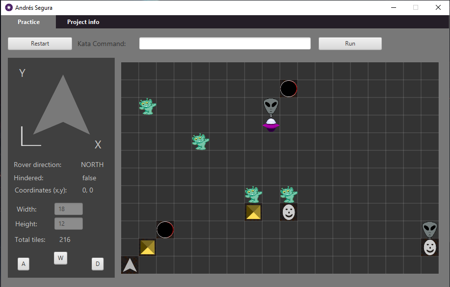

# Practice-RoverMars-app

Representación gráfica y aplicación de escritorio funcional del desafío de programación "Rover Mars Kata".

---

 

 

 

---

### Descargar app

https://github.com/Andr7st/Practice-RoverMars-app/releases

No es necesario descargar java para ejecutar esta aplicación ya que las librerías necesarias ya vienen incluidas.

 * En Windows se debe extraer el archivo .zip y ejecutar el archivo `Andr7st.exe`, es posible que el sistema de windows detecte que no conoce al publicador de .exe así que si te sale un aviso de ejecución permite que se ejecute.

 * En Linux (debian based) extraer el .tar.gz y ejecutar el archivo `Andr7st.sh` depués de haber concedido los permisos de ejecusión.

 

|   Release version 	| Linux  	|  Windows 	| 
|---	|---	|---	|
| pre-release  	|  [__rover-mars-app.tar.gz__](https://github.com/Andr7st/Practice-RoverMars-app/releases/download/linux/andr7st.s-rover-mars-app.tar.gz) 	|  [__rover-mars-app.zip__](https://github.com/Andr7st/Practice-RoverMars-app/releases/download/windows/andr7st.s-rover-mars-app.zip) 	|

 
 

---

[**Andr7st**](https://github.com/Andr7st/)
